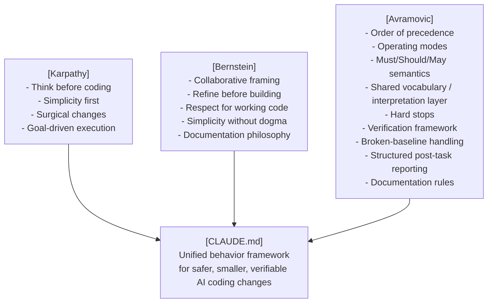

# CLAUDE.md That Works

One file. Zero dependencies. Discipline every AI coding session.


## Overview

The global `CLAUDE.md` that makes AI coding assistants actually behave, so every coding session becomes more disciplined, more predictable, and more productive.

Works natively with **Claude Code** and **OpenCode**. For other agent tools, you can reuse the same framework through their preferred instruction file convention, such as `AGENTS.md` or `GEMINI.md`. No setup. No dependencies. One file.

Heavily inspired by [Andrej Karpathy's](https://x.com/karpathy/status/2015883857489522876) observations on LLM coding pitfalls ([Multica adaptation](https://github.com/multica-ai/andrej-karpathy-skills)), and by [David Scott Bernstein's](https://github.com/ThePassionateProgrammer/knowledge-base-starter) partnership-driven working-agreement style. Then significantly extended, systematized, and refined for real-world use.


## The Problem It Solves

AI coding assistants, left unchecked, tend to:

- Start coding before clarifying ambiguous requirements
- Add unrequested features, abstractions, and "improvements"
- Expand scope mid-task - refactor while fixing, "improve" while adding
- Silently rename files, change APIs, or rewrite working code
- Skip verification until after the mistake is already in the diff
- Suppress errors without telling you
- Push to version control or delete files without warning
- Run destructive CLI commands or modify secrets with no safety gate
- Ship incomplete or stub implementations and call them done
- Pick arbitrarily when rules conflict, choosing helpfulness over safety

This file encodes behavioral contracts that prevent all of these before they happen.


## Key Features

### Four Core Coding Principles

The framework is built around four foundational disciplines: think before coding, prefer simplicity, make surgical changes, and define success through verification. These principles form the backbone that everything else builds on.

### Collaborative Working Model

The file defines a clear human/AI partnership: the human brings domain knowledge and architectural intent, while the AI contributes speed, pattern recognition, critique, and exploration. The AI is expected to refine ideas collaboratively and wait for an explicit boundary before building.

### Order of Precedence

When rules conflict, the AI knows exactly which wins. Hard stops override everything unless explicitly authorized, then explicit instruction overrides defaults, then correctness and safety override elegance or speed.

### Three Named Operating Modes

- **default mode** - make the smallest correct change that satisfies the request
- **ambiguity mode** - stop and ask when uncertainty affects behavior, interfaces, data, safety, or irreversible work
- **cleanup mode** - broader simplification and deletion are allowed only when explicitly requested

This gives the AI an explicit operating model instead of leaving behavior to chance.

### Wording Conventions (Must / Should / May)

RFC-style rule weight removes ambiguity. `Must/Never` means mandatory, `Should/Prefer` means strong default, and `May` means optional.

### Shared Vocabulary / Interpretation Layer

The file defines terms like *trivial task*, *minor ambiguity*, *harmful pattern*, and *working code* so the user and the AI share vocabulary from the start.

### Scope Control for Existing Code

This is one of the most practical protections in the file. It prevents the AI from touching adjacent code, silently expanding scope, rewriting working systems, or using cleanup as an excuse to change unrelated areas.

### Hard Stops with Rule Citation and Authorization Gate

When the AI cannot proceed, it does not just stop - it explains **which rule** caused the stop, creating an audit trail around dangerous actions such as destructive CLI commands, secret modification, silent signature changes, swallowed errors, or incomplete delivery. When a hard stop applies, it says so explicitly, states which rule triggers it, and does not proceed until you authorize an exception.

### Verification by Task Type with Manual Fallback

Different work requires different proof:

- **Bug fix** → reproduce the failing case, then make it pass
- **New feature** → verify the public interface, not internals
- **Refactor** → verify observable behavior before and after
- **No automated tests** → define manual verification steps explicitly before proceeding

### Broken Baseline Handling

If the baseline is already broken, the AI must say so before making changes, define success relative to the existing state, and avoid pretending the entire system is verified when unrelated failures remain.

### Structured Post-Task Report

After any non-trivial task, the AI should report:
- What changed
- What was verified
- What remains unverified
- Problems noticed but intentionally left untouched

### Documentation Philosophy and Rules

The file treats documentation with the same discipline as code: explain the **why**, update docs when behavior changes, and avoid comments that merely repeat the code or rot faster than the implementation.


## Fully Agnostic By Design

This file works regardless of your:

| Dimension | Agnostic |
|---|---|
| Programming language | ✅ Python, C, JS, TypeScript, C#, Java, Pascal, Rust… |
| Framework | ✅ React, Django, Qt, bare-metal… |
| Library | ✅ No dependencies referenced |
| AI tool | ✅ Claude Code, OpenCode, and adaptable to other instruction-file tools |
| OS | ✅ Windows, Linux, macOS |
| Domain | ✅ Web, embedded, desktop, scripts, data |
| Project type | ✅ New projects, legacy code, refactors |
| Verification method | ✅ Automated tests, manual validation, reproducible checks, baseline comparison |

Add project-specific stack details in a **project-level** instruction file. Keep the global file universal.


## How It Comes Together




## How It Differs From the Originals

| Feature | Karpathy | Bernstein | This repo |
|---|---|---|---|
| Core coding rules | ✅ | partial | ✅ inherited + refined |
| Collaborative partnership framing | ❌ | ✅ | ✅ inherited + refined |
| Order of Precedence | ❌ | ❌ | ✅ new |
| Operating modes | ❌ | ❌ | ✅ new |
| Must/Should/May wording conventions | ❌ | ❌ | ✅ new |
| Shared vocabulary / interpretation layer | ❌ | ❌ | ✅ new |
| Existing-code scope discipline | partial | partial | ✅ formalized |
| Hard stops with rule citation | ❌ | ❌ | ✅ new |
| Hard-stop explanation protocol | ❌ | ❌ | ✅ new |
| Verification by task type | ❌ | partial | ✅ formalized |
| Verification fallback to manual steps | ❌ | ❌ | ✅ new |
| Broken-baseline handling | ❌ | ❌ | ✅ new |
| Structured post-task reporting | ❌ | ❌ | ✅ new |
| Dedicated documentation rules | ❌ | partial | ✅ formalized |
| Full multi-dimensional agnosticism | partial | partial | ✅ made explicit |


## Installation

**Windows (PowerShell):**

```powershell
mkdir -Force "$HOME\.claude" > $null; Invoke-WebRequest -Uri "https://raw.githubusercontent.com/zeljkoavramovic/karpathy-bernstein-avramovic/master/CLAUDE.md" -OutFile "$HOME\.claude\CLAUDE.md"
```

**Linux / macOS:**

```bash
mkdir -p ~/.claude && curl -fsSL https://raw.githubusercontent.com/zeljkoavramovic/karpathy-bernstein-avramovic/master/CLAUDE.md -o ~/.claude/CLAUDE.md
```

Works natively with **Claude Code** and **OpenCode**. For other AI coding tools, follow that tool's instruction file convention (e.g., `AGENTS.md`, `GEMINI.md`) - the content is the same, the filename depends on the tool.


## Related Projects

- **[Agentic Design Patterns](https://zeljkoavramovic.github.io/agentic-design-patterns/)** - Interactive tutorial covering essential patterns for building intelligent AI systems: **core patterns** (prompt chaining, routing, parallelization, tool use, code-then-execute, dynamic scaffolding), **reasoning & strategy patterns** (reflection, planning, reasoning techniques, parallel fusion, prioritization, exploration & discovery), **orchestration patterns** (multi-agent collaboration, goal setting & monitoring, inter-agent communication, awareness, resource-aware optimization), **infrastructure & state patterns** (memory management, learning and adaptation, model context protocol, knowledge retrieval/RAG, evaluation & monitoring, session isolation), and **reliability & control patterns** (the stop hook, exception handling & recovery, human-in-the-loop, the Ralph Wiggum loop, guardrails & safety, spec-first agent). Each pattern includes a description, diagram, when-to-use guidance, where it fits in the bigger picture, pros/cons, and real-world examples. There is also a visual relationship diagram showing how patterns interconnect.


## Credits

- **[Andrej Karpathy](https://x.com/karpathy/status/2015883857489522876)** - observations on LLM coding pitfalls
- **[Multica](https://github.com/multica-ai/andrej-karpathy-skills)** - CLAUDE.md adaptation of Karpathy's principles
- **[David Scott Bernstein](https://github.com/ThePassionateProgrammer)** - partnership-driven working-agreement style
- **[Zeljko Avramovic](https://github.com/zeljkoavramovic)** - systematization and expansion: precedence model, operating modes, wording semantics, shared vocabulary layer, verification framework, hard-stop protocol, broken-baseline handling, task reporting, documentation rules


## Support the Project

If this saved you time, frustration, or a bad deployment, support is most welcome:

- ⭐ **Star the repository**
- 💬 **Share the repository**
- <a href="https://buymeacoffee.com/cupofavra" target="_blank">
     
   </a>


## License

MIT - use freely, improve openly, credit kindly.
